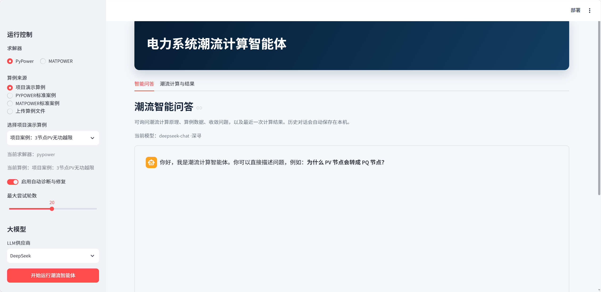
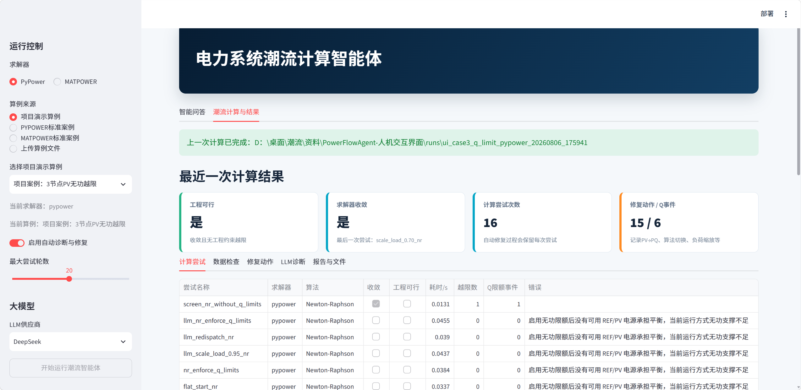
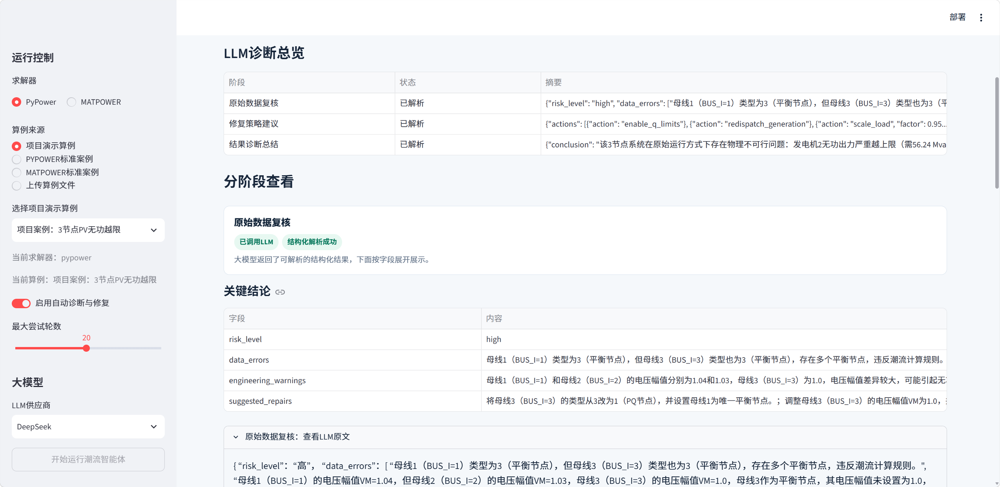
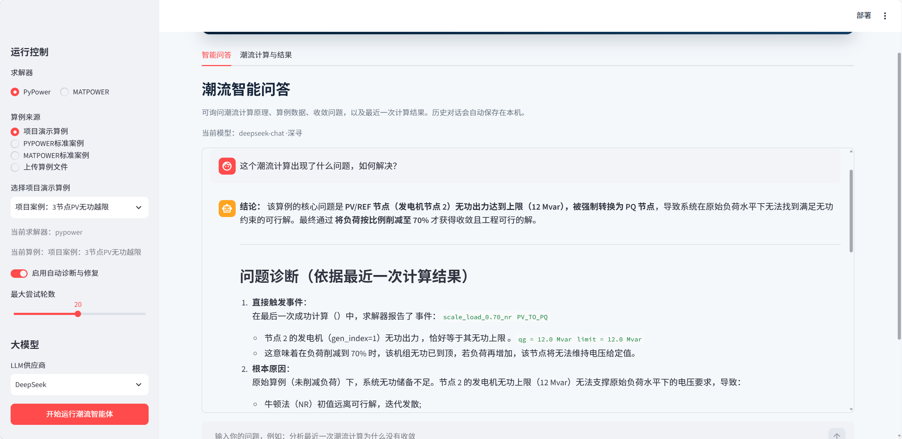

# 电力系统潮流计算智能体

面向潮流计算初学者和工程算例排错场景的 Python 项目。它以 **PYPOWER / MATPOWER** 为数值求解基础，在常规潮流计算之外，补充了数据检查、可行性判断、自动修复尝试、计算报告，以及 Streamlit 人机交互界面。

> 建议第一次使用时，先运行 IEEE 9 节点示例，再查看生成的 `report.md`；熟悉后再尝试带故障的 3 节点算例和自己的文件。

## 能做什么

- 读取并运行 MATPOWER（`.m` / `.mat`）、PYPOWER（`.py`）或 JSON 格式的潮流算例；
- 使用 PYPOWER 或本机 MATPOWER 执行交流潮流计算；
- 检查常见问题：节点类型、孤岛、机组无功限额、支路参数和部分工程约束；
- 当算例不可行或不收敛时，按规则尝试平坦启动、算法切换、机组再调度和负荷搜索；
- 记录每次尝试、PV→PQ 切换和修复动作，并导出 Markdown、JSON 和最终算例；
- 可选接入 DeepSeek、Kimi 等 OpenAI-compatible 模型，辅助解释数据问题和计算结果；
- 通过 Streamlit 页面选择算例、上传文件、查看运行日志和浏览历史计算记录。

## 界面与运行效果

图形界面把完整的智能体流程集中到一个网页中：**选择求解器与算例 → 检查数据 → 执行潮流计算 → 诊断失败或越限 → 尝试可追溯的修复动作 → 输出报告 → 使用 LLM 解读结果并继续问答**。

### 1. 智能体网页整体展示

Streamlit 主界面分为运行控制区和结果工作区。左侧可以选择 PYPOWER 或 MATPOWER 求解器，并从项目演示算例、标准算例或用户上传文件中选择输入；同时可以控制是否启用自动诊断与修复、设置最大尝试轮数并选择 LLM 供应商。右侧提供“智能问答”和“潮流计算与结果”两个工作页签。



### 2. 算例运行与结果输出

下图展示 3 节点 PV 无功越限案例的一次完整运行。结果页首先汇总“工程可行”“求解器收敛”“计算尝试次数”和“修复动作 / Q 事件”等关键指标，再通过“计算尝试、数据检查、修复动作、LLM 诊断、报告与文件”页签保留完整过程。用户不仅能看到最终是否收敛，还能追踪每轮算法、耗时、越限、PV→PQ 切换及失败原因。



### 3. 大语言模型（LLM）分析展示

配置 LLM 后，智能体可以对原始数据复核、修复策略建议和最终结果诊断进行结构化解释。界面会区分每个阶段是否调用模型、结构化解析是否成功，并展开显示风险等级、数据错误、工程警告和建议修复动作。LLM 用于辅助解释与提出建议，实际潮流解仍由 PYPOWER 或 MATPOWER 数值求解器计算。



### 4. 人机交互与智能问答

智能问答会结合最近一次潮流计算报告回答问题，可用于解释不收敛原因、PV/REF 节点无功越限、PV→PQ 转换、负荷缩放以及最终工程可行性。对话历史保存在本机，便于围绕同一算例继续追问，同时避免把数值求解和语言模型解释混为一谈。



## 先理解三个概念

| 概念 | 本项目中的含义 |
| --- | --- |
| 数值收敛 | 求解器找到了潮流方程的数值解。它不一定代表结果满足全部工程约束。 |
| 工程可行 | 在数值收敛基础上，进一步通过项目定义的约束检查；命令行会优先报告这个状态。 |
| 自动修复 | 对输入数据或求解设置作有限、可追溯的尝试，不等同于替代工程人员的建模和校核。 |

## 快速开始

### 方式一：Windows 一键启动（适合初学者）

进入 [`scripts/windows`](scripts/windows/) 后，按顺序双击：

1. `一键安装环境.bat`：创建 `.venv` 并安装核心依赖；
2. `安装图形界面依赖.bat`：安装 Streamlit 和 pandas；
3. `启动潮流智能体界面.bat`：启动网页界面。

随后在浏览器打开终端提示的地址，通常是 `http://localhost:8501`。界面左侧可选项目内置算例、PYPOWER 标准算例、MATPOWER 标准算例，或上传自己的 `.py`、`.m`、`.mat`、`.json` 文件。

### 方式二：命令行（适合开发与复现）

要求：Python 3.10 或更高版本。在仓库根目录执行：

```powershell
python -m venv .venv
.\.venv\Scripts\python.exe -m pip install --upgrade pip
.\.venv\Scripts\python.exe -m pip install -r requirements.txt
.\.venv\Scripts\python.exe -m pip install -e .
```

如需图形界面，再安装 UI 依赖并启动：

```powershell
.\.venv\Scripts\python.exe -m pip install -r requirements-ui.txt
.\.venv\Scripts\streamlit.exe run .\apps\streamlit\web_ui.py
```

先检查环境是否就绪：

```powershell
.\.venv\Scripts\python.exe -m pfagent doctor
```

若只使用 PYPOWER，显示 `numpy`、`scipy`、`pypower` 为 `OK` 即可。若要选择 MATPOWER 求解器，还需要安装 MATLAB 与 MATPOWER，并正确配置 `MATPOWER_PATH`。

## 第一次运行：从正常算例开始

运行 IEEE 9 节点示例：

```powershell
.\.venv\Scripts\python.exe -m pfagent run .\examples\case9_demo.py --engine pypower
```

成功运行后，终端会打印报告、JSON 和最终算例的路径。默认结果写入：

```text
runs/<算例名>_<时间戳>/
├── report.md                 # 建议优先阅读：过程和结论的可读报告
├── report.json               # 便于程序二次处理的结构化结果
└── final_feasible_case.py    # 最终导出的可行算例（若产生）
```

阅读 `report.md` 时，依次关注：原始数据检查结果 → 每次求解尝试 → 修复动作 → Q 限额事件 → 最终“工程可行”结论。若“数值收敛”为真但“工程可行”为否，说明还应查看越限或约束检查项，而不能只看收敛标志。

## 常用命令

```powershell
# 只检查算例，不运行自动修复
.\.venv\Scripts\python.exe -m pfagent inspect .\examples\case3_bad_data.py

# 运行算例，并将本次结果写到指定目录
.\.venv\Scripts\python.exe -m pfagent run .\examples\case3_repairable.py --engine pypower --out .\runs\case3_repairable

# 仅计算与诊断，不允许自动修改/搜索
.\.venv\Scripts\python.exe -m pfagent run .\examples\case3_q_limit.py --no-auto-repair

# 运行全部自动化测试
.\.venv\Scripts\python.exe -m pytest -q
```

完整演示可一次运行 9 节点正常算例、可修复 3 节点算例和 PV 无功越限算例：

```powershell
.\.venv\Scripts\python.exe .\examples\demo_vscode.py
```

在 VS Code 中操作的详细步骤见 [docs/VSCode演示步骤.md](docs/VSCode演示步骤.md)。

## 内置算例如何选择

| 文件 | 推荐用途 | 你会看到什么 |
| --- | --- | --- |
| `examples/case9_demo.py` | 第一次验证安装 | IEEE 9 节点的正常潮流流程 |
| `examples/case3_repairable.py` | 学习数据检查和修复 | 缺少 REF 节点、异常初值的检查与修复尝试 |
| `examples/case3_q_limit.py` | 学习无功限额 | PV 节点无功越限、PV→PQ 转换与方案搜索 |
| `examples/case3_bad_data.py` | 练习诊断 | 多种坏数据的定位与解释 |

## 使用自己的算例

1. 优先复制一个 `examples/` 中的 `.py` 文件作为模板，保留 PYPOWER/MATPOWER 所要求的 `baseMVA`、`bus`、`gen`、`branch` 等字段；
2. 先执行 `pfagent inspect <文件>`，确认基础数据检查结果；
3. 再执行 `pfagent run <文件>`，并保存生成的 `runs/` 报告；
4. 对自动修复得到的结果，应回到原始工程数据逐项确认，尤其是节点类型、机组出力、无功限额和支路参数。

上传到图形界面的文件会保存到本机 `runs/_ui_uploads/`，运行历史和报告也保存在本机 `runs/`，它们均不应提交到 GitHub。

## 可选：启用大模型辅助

不配置 API Key 时，项目仍可以用规则模式完成计算和诊断。配置密钥后，模型可辅助生成数据问题说明、修复建议和结果解读，但不会替代数值求解器。

PowerShell 临时设置示例：

```powershell
$env:DEEPSEEK_API_KEY="你的 API Key"
.\.venv\Scripts\python.exe -m pfagent inspect .\examples\case3_bad_data.py --llm-provider deepseek
```

也可以将 [`.env.example`](.env.example) 复制为本机 `.env` 后自行管理。不要提交 `.env`、真实 API Key、`.venv/`、`runs/` 或缓存文件。

## 目录导航

```text
.
├── src/pfagent/          # 核心包：求解、诊断、修复、报告、LLM 接口与命令行
├── apps/streamlit/       # Streamlit 人机交互页面
├── examples/             # 可直接运行的示例算例与完整演示入口
├── tests/                # 自动化测试
├── scripts/              # 环境安装脚本；windows/ 为双击启动脚本
├── docs/                 # 演示步骤、任务与修改说明
├── .streamlit/           # Streamlit 配置（需保留在仓库根目录）
├── pyproject.toml        # Python 打包和 pfagent 命令入口
├── requirements.txt      # 核心依赖
└── requirements-ui.txt   # 图形界面依赖
```

## 二次开发说明

本仓库在原有命令行潮流计算智能体的基础上进行二次开发，维护者为 [Pan-sanhuo](https://github.com/Pan-sanhuo)。本次开发补充了 Streamlit 人机交互界面、运行记录管理、可视化参数配置及 Windows 启动脚本。

原始项目及第三方依赖的版权仍归各自作者所有，并应遵循其原有许可证。本仓库未附带独立许可证时，不代表自动授予额外的复制、分发或商业使用权。
